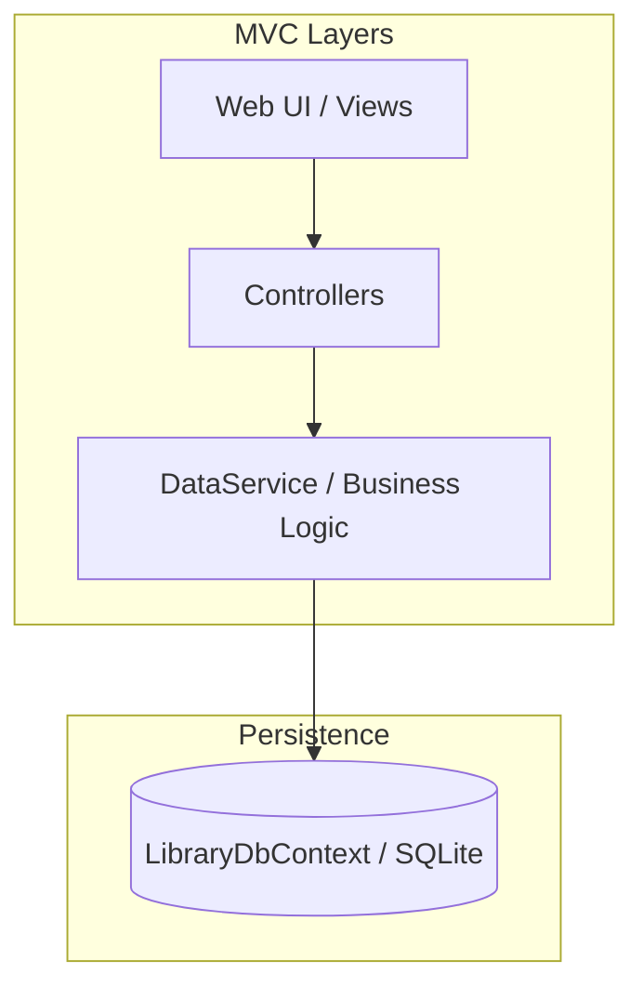
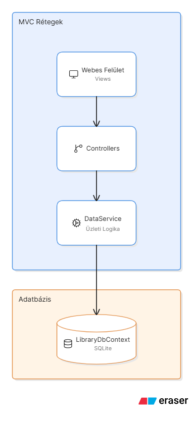
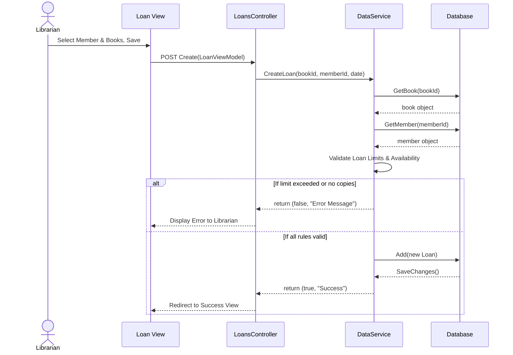
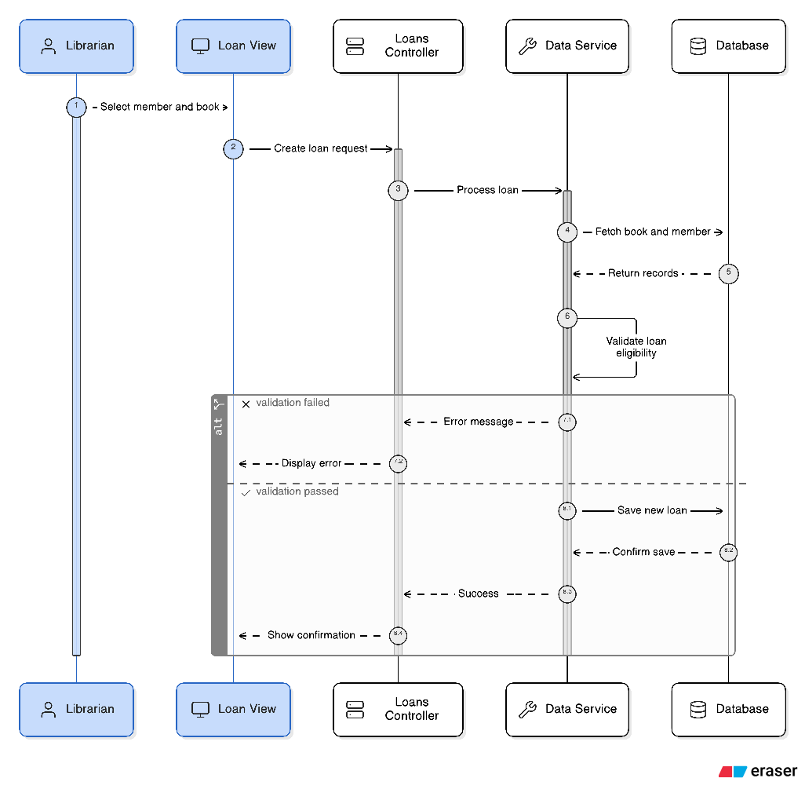
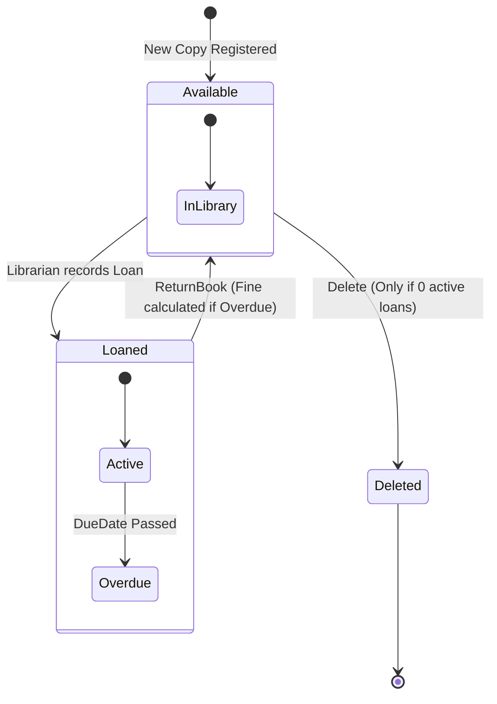
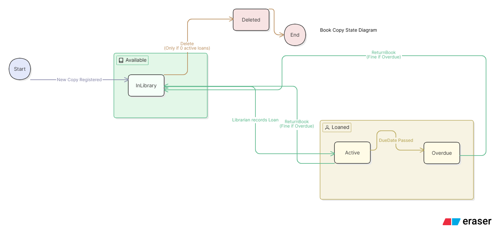

# Wiki – LibrarySystem Részletes Dokumentáció (3. Mérföldkő)

## 1. Rendszerarchitektúra és Kódminőség
Az alkalmazás követi a **Clean Architecture** alapelveit a Model-View-Controller (MVC) mintán belül. A `DataService` tartalmazza az összes üzleti logikát, így a Controllerek "vékonyak", felelősségi köreik tiszták és könnyen tesztelhetőek maradnak. A kód írása során törekedtem a Clean Code elvek betartására (pl. beszédes változónevek, DRY elv, egyértelmű felelősségi körök). Nincsenek halogatott architekturális hibák.

## 2. Funkciók és Használati Esetek (90% Implementáció)

### 2.1 Bejelentkezés és Biztonság
A könyvtárosnak be kell jelentkeznie (felhasználónév és jelszó). 
**Biztonsági szabály:** Három hibás próbálkozás után a rendszer zárolja a felületet és *ténylegesen leállítja a futást* (az `IHostApplicationLifetime.StopApplication()` meghívásával teljesítve a feladat "kilép" követelményét).

### 2.2 Entitások Kezelése (CRUD) és Szűrések
- **Könyvek:** Nyilvántartásba vehetőek (cím, szerző, kiadó, év, ISBN, példányszám). Több azonos könyv felvitelekor a példányszám növekszik. Csak olyan könyv törölhető, ami nincs éppen kikölcsönözve. Keresés lehetséges Szerző, Cím, ID és ISBN alapján.
- **Tagok:** Polimorfikus felépítés. Öröklődéssel négy típus van megvalósítva:
  - `StudentMember` (Egyetemi hallgató): Max 5 könyv, 60 nap.
  - `ProfessorMember` (Egyetemi oktató): Korlátlan könyv, 365 nap.
  - `ExternalMember` (Külsős): Max 4 könyv, 30 nap.
  - `OtherMember` (Egyéb): Max 2 könyv, 14 nap.
  Keresés lehetséges Név, ID és Lakcím alapján. Aktív kölcsönzéssel rendelkező tag nem törölhető.

### 2.3 Kölcsönzés és Késedelmi díj logika
A kölcsönzési folyamat biztonságos *autocomplete* kereséssel történik. A rendszer valós időben ellenőrzi a tag kapacitását és megakadályozza a limit túllépését. A `ReturnBook` metódus a visszavétel pillanatában ellenőrzi a határidőt, és kiszámítja a napi 50 Ft büntetést késés esetén.

---

## 3. Diagramok (Mermaid)

### 3.1 Component Diagram (Architecture)

### 3.2 Sequence Diagram (Loan Creation)

### 3.3 State Diagram (Book Copy Lifecycle)

---
